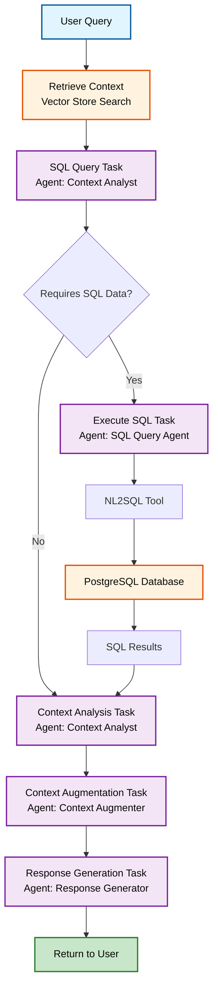

# Bella Terra CAG System


This project demonstrates Crew AI with CAG (Context-Aware Generation) for intelligent restaurant menu and wine pairing recommendations. The application includes a backend API powered by FastAPI and OpenAI, a modern frontend built with Next.js and TypeScript, and comprehensive sample data from BellaTerra restaurant including menus, wine lists, and regional culinary stories.

The demo showcases how CAG can provide contextually aware responses by leveraging structured data about restaurant offerings, customer preferences, and regional culinary traditions to generate personalized recommendations.

## Project Structure

This section provides an overview of the key files and directories in the project root:

### Core Application Files
- **`api.py`** - Main FastAPI backend server that handles API requests
- **`cag_system.py`** - Core CAG (Context-Aware Generation) system implementation
- **`docker-compose.yml`** - Docker Compose configuration for running the full application stack
- **`Dockerfile.api`** - Docker configuration for the backend API service
- **`Dockerfile.frontend`** - Docker configuration for the frontend service
- **`populate_db.py`** - Database population script with sample data

### Frontend
- **`frontend/`** - Next.js React application with TypeScript and Tailwind CSS

### Database
- **`database/schema.sql`** - PostgreSQL database schema definition

### Data and Content
- **`data/`** - Application data including regional culinary stories and menu philosophies
- **`BellaTerra/`** - Restaurant-specific content including menus and wine lists

### Scripts and Utilities (for use outside of Docker)
- **`setup.sh`** - Initial project setup script
- **`start_full_stack.sh`** - Script to start the complete application stack
- **`run_api.sh`** - Script to run the API server locally
- **`test_api.py`** - API testing utilities

### Dependencies
- **`requirements.txt`** - Python dependencies for the main application
- **`requirements_api.txt`** - Python dependencies specifically for the API

### Configuration Files
- **`.env.example`** - Example environment variables template
- **`.gitignore`** - Git ignore rules
- **`.dockerignore`** - Docker ignore rules

## 🏗️ Architecture

The system is structured into three main components:

### 📁 Directory Structure

```
nimble-cag-demo/
├── api/                    # FastAPI backend service
│   ├── main.py            # API entry point
│   ├── Dockerfile         # API container configuration
│   ├── tests/             # API tests
│   ├── cag/               # CAG system library
│   │   ├── core/          # Core CAG components
│   │   ├── agents/        # CrewAI agents
│   │   ├── tasks/         # Agent tasks
│   │   └── utils/         # Utility functions
│   └── app/               # API application modules
│       ├── models.py      # Pydantic models
│       ├── routes/        # API endpoints
│       ├── services/      # Business logic services
│       └── middleware/    # Middleware components
├── db_populator/          # Database population service
│   ├── main.py            # Database populator entry point
│   ├── Dockerfile         # Database populator container
│   ├── parsers/           # Menu parsing logic
│   └── database/          # Database operations
├── frontend/              # Next.js frontend
│   ├── Dockerfile         # Frontend container configuration
│   ├── public/            # Static assets
│   └── src/               # Frontend source code
├── data/                  # Restaurant knowledge base
├── BellaTerra/            # Menu files
├── chroma_db/             # Vector store data
├── docker-compose.yml     # Service orchestration
```

## 🚀 Quick Start

### Prerequisites

- Docker and Docker Compose
- OpenAI API key

### 1. Environment Setup

Create a `.env` file in the root directory:

```bash
OPENAI_API_KEY=your_openai_api_key_here
```

### 2. Start the Full Stack

```bash
# Build and start all services
docker-compose up --build

# Run in background
docker-compose up -d --build
```

This will start:
- **Database**: PostgreSQL with Bella Terra menu data
- **Database Populator**: Automatically populates the database with menu data
- **API**: FastAPI backend with CAG system integration
- **Frontend**: Next.js web interface

### 3. Access the Application

- **Frontend**: http://localhost:3000
- **API**: http://localhost:8000
- **API Documentation**: http://localhost:8000/docs

## 🐳 Docker Deployment

### Full Stack with Docker Compose

```bash
# Build and start all services
docker-compose up --build

# Run in background
docker-compose up -d --build

# Stop all services
docker-compose down
```

### Individual Services

```bash
# Start only the database
docker-compose up db

# Start database and API
docker-compose up db api

# Start database and populate it
docker-compose up db db-populator
```

## 🔧 Development

### API Development

```bash
cd api
pip install -r requirements.txt
python -m uvicorn main:app --reload --host 0.0.0.0 --port 8000
```

### CAG System Development

```bash
cd cag
pip install -r requirements.txt
python -c "from core.cag_system import CAGSystem; cag = CAGSystem()"
```

### Database Population

```bash
cd db_populator
pip install -r requirements.txt
python main.py
```

### Frontend Development

```bash
cd frontend
npm install
npm run dev
```

## AI Workflow

The CAG (Context-Aware Generation) system uses a multi-agent workflow to provide intelligent responses about Bella Terra restaurant. The system combines vector search for contextual knowledge with SQL queries for structured data.

### Agents

1. **Context Analyst** - Analyzes user queries and determines whether structured SQL data is needed
2. **SQL Query Agent** - Executes natural language to SQL queries against the menu database (if required)
3. **Context Augmenter** - Enhances retrieved context with additional insights and relationships
4. **Response Generator** - Creates comprehensive, accurate responses using all available context

### Data Sources

- **Vector Store** (ChromaDB) - Contains restaurant philosophy, regional culinary stories, and menu descriptions
- **SQL Database** (PostgreSQL) - Stores structured menu data including prices, ingredients, and dietary information

### Workflow Diagram



### Task Flow

1. **SQL Query Task** - The Context Analyst evaluates whether the query needs structured data (prices, ingredients, etc.) or can be answered with descriptive content
2. **SQL Execution Task** - If SQL data is needed, the SQL Query Agent converts natural language to SQL and queries the database. Vector search retrieves relevant contextual information
3. **Context Analysis** - The Context Analyst examines both vector store results and SQL data to identify key information and relationships
4. **Context Augmentation** - The Context Augmenter enhances the information by identifying patterns, relationships, and implicit connections between menu items
5. **Response Generation** - The Response Generator creates a comprehensive, accurate response using all available context

This workflow ensures responses are both contextually rich and factually accurate, combining the depth of descriptive content with the precision of structured data.
